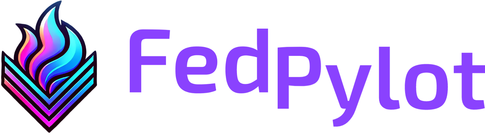

<div align="center">
  
</div>

--------------------------------------

<h2 align="center">
    <p>Federated Learning for Real-Time Object Detection in Internet of Vehicles</p>
</h2>

<p align="center">
    <a href="https://github.com/CyprienQuemeneur/fedpylot/blob/main/LICENSE"></a>
    <a href="https://arxiv.org/abs/2406.03611"></a>
</p>

**Official repository** of:
- [Cyprien Quéméneur](https://scholar.google.com/citations?hl=en&user=qQ5fKGgAAAAJ),
[Soumaya Cherkaoui](https://scholar.google.be/citations?user=fW60_n4AAAAJ). 
[**FedPylot: Navigating Federated Learning for Real-Time Object Detection in Internet of Vehicles**](https://arxiv.org/abs/2406.03611).

For questions or inquiries about this program, please contact
[cyprien.quemeneur@protonmail.com](mailto:cyprien.quemeneur@protonmail.com).

## 📖 Features

FedPylot supports federated optimization on a computer cluster where one federated participant matches one node. The
shared object detection model is initialized by the central server using weights pre-trained on MS COCO. Model 
evaluation is performed by the server on a set of unseen examples at the end of each round. We assume full-client
participation, synchronous updates and state persistence.

- Object detector: YOLOv7
- Communication backend: MPI
- Server-side optimizers: FedAvg, FedAvgM, FedAdagrad, FedAdam, FedYogi
- Local optimizers: SGD, YOLOv7 default
- Datasets: KITTI (IID), nuImages (non-IID)

In addition, weights are reduced to half-precision during communications and protected using hybrid encryption
(AES-GCM + RSA). More advanced model compression and privacy-preservation techniques are not currently supported.
The default optimizer of YOLOv7 involves SGD with Nesterov momentum, weight decay and a one-cycle cosine annealing 
policy for the learning rates.

For more details on our experiments, please see our [paper](https://arxiv.org/abs/2406.03611).

## 🐍 Installation

We encourage to install FedPylot both locally and on your computer cluster, as a local env will be more suited for
preparing the data and can help for prototyping.

```bash
git clone https://github.com/CyprienQuemeneur/fedpylot.git
```

To install the necessary packages in your local virtual environment run:

```bash
pip install -r requirements.txt
```

Installing all the packages on your cluster can come with some subtleties, and we would advise to refer to the
documentation of your cluster for package installation and loading.

## ⚙️ Data Preparation

We used two publicly available autonomous driving datasets in our paper: the 2D object detection subset of the KITTI
Vision Benchmark Suite and nuImages, an extension of nuScenes dedicated to 2D object detection.

Preparing the data involve both converting the annotations to the YOLO format and splitting the samples among the
federated participants. In our experiments, we assume that the server holds a separate validation set and is 
responsible for evaluating the global model.

Data preparation should ideally be run locally. Splitting the original dataset will create a folder for each
federated participants (server and clients) which will contain the samples and labels. Archiving the folders before
sending them to the cluster is recommended and can be performed automatically by the preparation scripts (intermediate
folders will not be deleted, ensure you have enough disk space). A good way to securely and reliably transfer a large
volume of data to the cloud is to use a tool such as [Globus](https://www.globus.org/).

#### KITTI

First go to https://www.cvlibs.net/datasets/kitti/eval_object.php?obj_benchmark=2d and create an account to download
the 2D object detection subset of KITTI. You will need to download the data samples,
`left color images of object data set (12 GB)`, and data labels, `training labels of object data set (5 MB)`, and unzip
the files in the `datasets` subfolder of this program.

By default, 25% of the training data is sent to the central server, as KITTI does not
feature a predefined validation set. For the remaining data, we perform a balanced and IID split among 5 clients.
The DontCare attribute is ignored. The random seed is fixed so that splitting is reproducible. To perform both the
split and the annotation conversion, run the following:

```bash
python datasets/prepare_kitti.py --tar
```

If you wish to modify our splitting strategy, simply edit `prepare_kitti.py`.

#### nuImages

Go to https://nuscenes.org/nuimages and create an account, then download the samples and metadata (sweeps are not 
needed), and unzip the files in the `datasets` subfolder of this program. Unlike KITTI, nuImages is organized
as a relational database, and we will use the `nuscenes-devkit` to manipulate the files. For the devkit to work
properly, you need to create a `nuimages` folder and move the folders corresponding to the samples and labels to it.
The folder structure should then be the following:
```
/datasets/nuimages
    samples	- Sensor data for keyframes (annotated images).
    v1.0-train  -  JSON tables that include all the metadata and annotations for the training set.
    v1.0-val    -  JSON tables that include all the metadata and annotations for the validation set.
```

nuImages predefined validation set is stored on the server, while the training data is split non-IID
among 10 clients based on the locations and timeframes at which the data samples were captured.

Run the following to create the split which retains only 10 classes based on the nuScenes competition:
```bash
python datasets/prepare_nuimages.py --class-map 10 --tar
```

And the following to retain the full long-tail distribution with 23 classes:
```bash
python datasets/prepare_nuimages.py --class-map 23 --tar
```

If you wish to modify our splitting strategy, simply edit `prepare_nuimages.py`.

## 🚀 Running a Job

We provide template job scripts for the centralized and the federated settings, assuming the cluster supports the
Slurm Workload Manager. We use official pre-trained weights to initialize an experiment. Downloading 
the appropriate weights is normally performed by the script that launches the job, but you need to do it manually if
Internet connexions are not available on the computing nodes of your cluster. FedPylot supports all YOLOv7 variants.
For example, to download pre-trained weights for YOLOv7-tiny run the following:

```bash
bash weights/get_weights.sh yolov7-tiny
```

To launch a federated experiment, you will need to modify `run_federated.sh` to fit your cluster's requirements and
choose the experimental settings, then run the command:

```bash
sbatch run_federated.sh
```

Similarly, to perform centralized learning, edit `run_centralized.sh` and then execute:

```bash
sbatch run_centralized.sh
```

In all cases, the data are copied to the local storage of the node(s) before training begins. For the federated setting,
this is performed with a separate MPI script `scatter_data.py`, which ensures that the local datasets are dispatched to
the appropriate federated participants.

## 🎓 Citation
If you find FedPylot is useful in your research or applications, please consider giving us a star 🌟 and citing our
paper.

```latex
@article{fedpylot2024,
      title = {{FedPylot}: Navigating Federated Learning for Real-Time Object Detection in {Internet} of {Vehicles}}, 
      author = {Quéméneur, Cyprien and Cherkaoui, Soumaya},
      journal = {arXiv preprint arXiv:2406.03611},
      year = {2024}
}
```

## 🤝 Acknowledgements
We sincerely thank the authors of [YOLOv7](https://github.com/WongKinYiu/yolov7) for providing their code to
the community!

## 📜 License
FedPylot is released under the [GPL-3.0 Licence](LICENSE).
